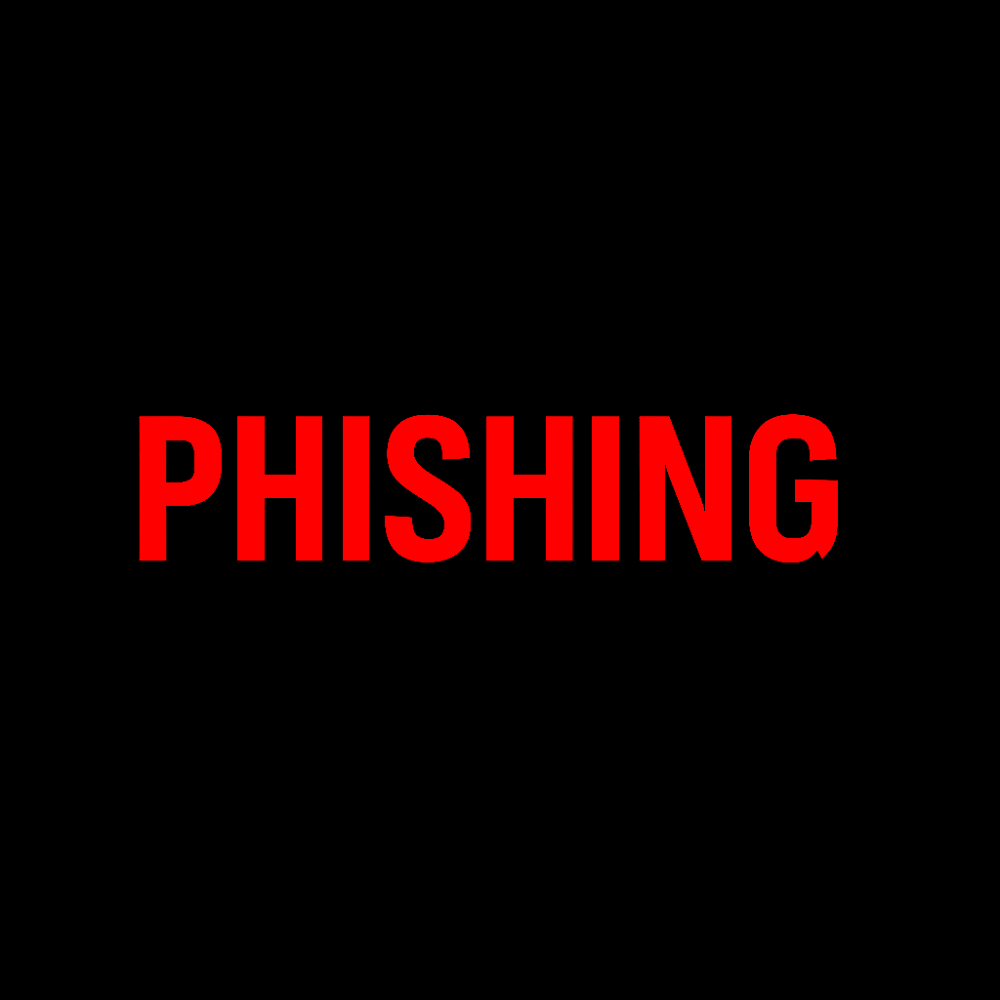

<!-- Image principale -->
<p align="center">

</p>

<!-- Badges centrés -->
<p align="center">

<a href="https://creativecommons.org/licenses/by-nc-sa/4.0/" target="_blank">

</a>
</p>


# 🛡️ Phishing : Comment se protéger – Bonnes pratiques

## Sommaire
1. [Introduction](#introduction)
2. [Bonnes pratiques anti-phishing + outils de vérification](#bonnes-pratiques-anti-phishing--outils-de-vérification)
3. [Pour aller plus loin](#pour-aller-plus-loin)
4. [Sécurité des macros – Pourquoi un fichier ne suffit pas](#sécurité-des-macros--pourquoi-un-fichier-ne-suffit-pas)
5. [Ce que cela signifie concrètement](#ce-que-cela-signifie-concrètement)
6. [Ce que dit Microsoft](#ce-que-dit-microsoft)
7. [Résumé technique](#résumé-technique)
8. [Mentions importantes](#mentions-importantes)
9. [Analyse d’un en-tête d’e-mail (headers)](#analyse-dun-en-tête-de-mail-headers)

---

## Introduction

Le **phishing** (ou hameçonnage) est une technique très répandue chez les cybercriminels.
Elle vise à tromper la victime pour lui faire **divulguer des informations sensibles** : mots de passe, coordonnées bancaires, identifiants, etc.

Ce projet a pour objectif de **sensibiliser** et de fournir des **bonnes pratiques concrètes**, accompagnées de **liens d’analyse** (email, pièces jointes, etc.).

---

## Bonnes pratiques anti-phishing + outils de vérification

1. **Vérifier l’adresse réelle de l’expéditeur**
🔗 [MailHeader Analyzer (Google)](https://toolbox.googleapps.com/apps/messageheader/)
🔗 [MXToolbox Email Header Analyzer](https://mxtoolbox.com/EmailHeaders.aspx)

2. **Survoler les liens avec la souris avant de cliquer**
🔗 [VirusTotal - Scanner d'URL](https://www.virustotal.com/)
🔗 [URLScan.io](https://urlscan.io/)

3. **Analyser les pièces jointes avant de les ouvrir**
🔗 [VirusTotal – Analyse de fichier](https://www.virustotal.com/gui/home/upload)

4. **Afficher et lire les en-têtes d’un e-mail (headers)**
À examiner : `From`, `Reply-To`, `Return-Path`, `Received`, `SPF`, `DKIM`

5. **Vérifier si un site est signalé comme dangereux**
🔗 [Google Safe Browsing](https://transparencyreport.google.com/safe-browsing/search)
🔗 [PhishTank](https://phishtank.org/)

6. **Rechercher à qui appartient un domaine (whois)**
🔗 [Who.is](https://who.is/)
🔗 [SecurityTrails](https://securitytrails.com/)

7. **Mettre à jour son antivirus et activer les protections antiphishing**
✅ Activer SmartScreen (Windows)
✅ Activer les protections Gmail / Outlook

8. **Ne jamais cliquer sur un lien inconnu dans un e-mail**
✍️ Tapez l’URL directement dans votre navigateur.

---

 Analyse d'un en-tête d'e-mail (headers)

| **Élément** | **Ce qu’il faut analyser** |
|-------------------|---------------------------------------------------------------------------------------------------------------------------------------------------------------|
| **From** | Est-ce l’adresse attendue ? (ex. : `support@banque.fr`) |
| **Reply-To** | Est-ce identique à l’adresse "From" ? Si c’est une autre adresse (ex. : `offre-banque@protonmail.com`), cela peut être suspect. |
| **Return-Path** | Adresse réelle de retour. Peut différer du "From" en cas de spoofing. |
| **Received** | Liste des serveurs par lesquels est passé l’e-mail. Une origine inattendue (ex. : serveur basé à l’étranger, VPN, etc.) est un signal d’alerte. |
| **DKIM / SPF / DMARC** | Signatures utilisées pour vérifier que le domaine de l’expéditeur est autorisé à envoyer l’e-mail. Si elles sont absentes ou échouées, cela indique un danger. |


## Pour aller plus loin
🔗 [Cybermalveillance.gouv.fr - Hameçonnage](https://www.cybermalveillance.gouv.fr/)
🔗 [CNIL – Reconnaître un e-mail frauduleux](https://www.cnil.fr/)

---

## Sécurité des macros – Pourquoi un fichier ne suffit pas

Depuis 2022, **Microsoft Office (Excel, Word)** désactive les **macros par défaut** pour tout fichier **téléchargé depuis Internet ou reçu par e-mail**.


---

## Ce que cela signifie concrètement

- Tant que l’utilisateur **n’active pas les macros**, aucun code malveillant ne s’exécute.
- C’est **uniquement après avoir cliqué sur "Activer le contenu"** que la macro se lance.
- Ensuite, le fichier peut :
- Se connecter à un serveur distant
- Télécharger un **payload** (virus)
- L’exécuter discrètement

💡 Cette méthode est couramment utilisée dans les attaques de **phishing + macro VBA**.

---

## Exemple de simulation d'attaque macro :

```vba
Private Sub Workbook_Open()
MsgBox "Étape 1 – Réception d’un e-mail piégé"
MsgBox "Étape 2 – Ouverture du fichier Excel, clic sur 'Activer le contenu'"
MsgBox "Étape 3 – Exécution de la macro"
Shell "notepad.exe", vbNormalFocus
MsgBox "Étape 4 – Propagation et chiffrement"
MsgBox "Leçon : cette attaque aurait pu être évitée si les macros étaient désactivées"
End Sub

----

Les outils et ressources externes mentionnés dans ce projet (ex. : VirusTotal, Google Header Analyzer, PhishTank…) sont tous **publics, légaux** et utilisés dans un **but exclusivement pédagogique**.

Aucune de ces plateformes n’est modifiée ou détournée.
Les liens sont fournis uniquement pour **sensibiliser aux bonnes pratiques** en matière de cybersécurité (analyse d’e-mails, de liens, de fichiers…).

> Ce projet n’encourage en aucun cas l’usage de techniques offensives sans autorisation légale préalable.

 Pour plus d'informations sur l'utilisation de liens à des fins pédagogiques :
- [Legifrance – Code de la propriété intellectuelle, Article L122-5](https://www.legifrance.gouv.fr/codes/article_lc/LEGIARTI000006278917/)
- [CNIL – Sensibilisation à la cybersécurité](https://www.cnil.fr)

---


