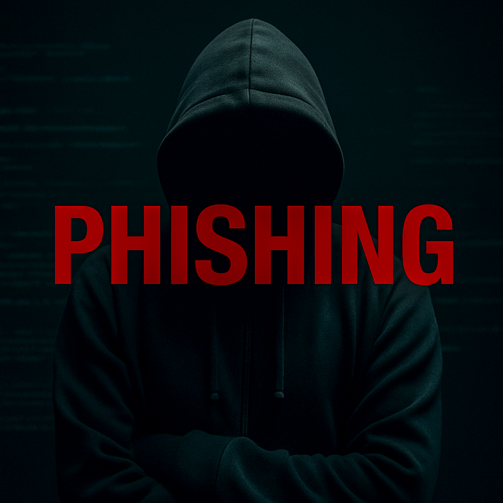
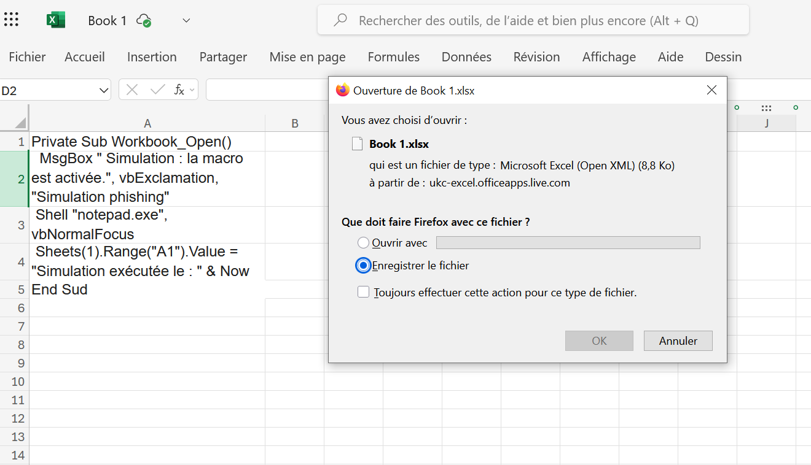
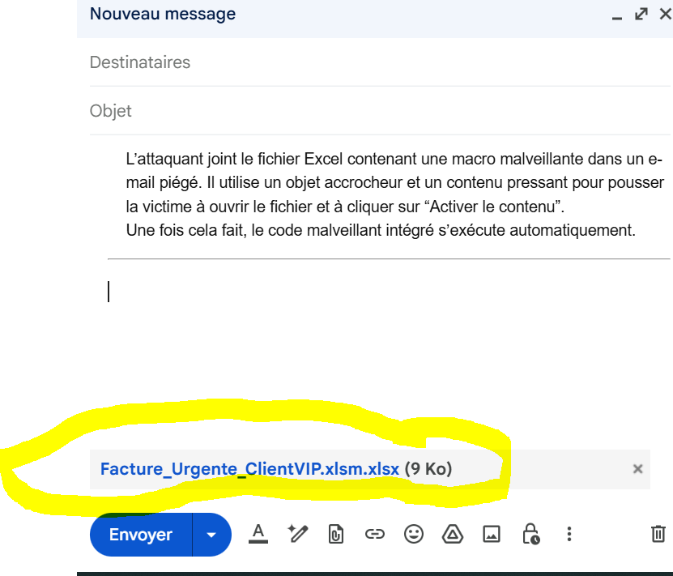
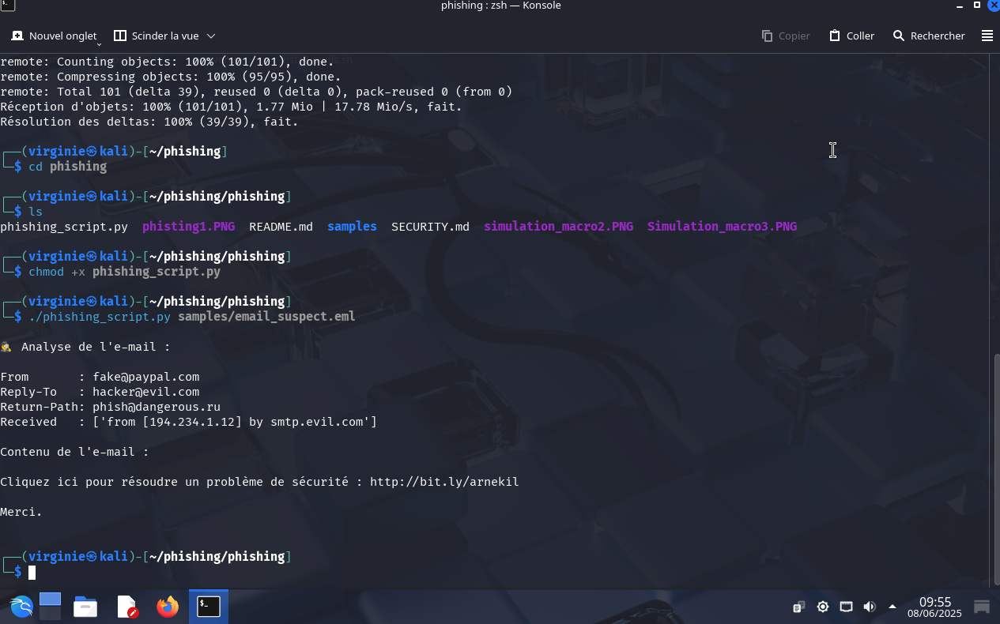

<!-- Image principale -->

<!-- Badges centrés -->

<!-- Mentions légales -->

<b>© 2026 Virginie Lechene 

---

## 🛡️ Phishing : Comment se protéger - Bonnes pratiques

### 🔗 Sommaire
1. [Introduction](#introduction)
2. [Bonnes pratiques anti-phishing + outils de vérification](#bonnes-pratiques-anti-phishing--outils-de-vérification)
3. [Analyse d'un en-tête d'e-mail (headers)](#analyse-dun-en-tête-demail-headers)
4. [Pour aller plus loin](#pour-aller-plus-loin)
5. [Sécurité des macros – Pourquoi un fichier ne suffit pas](#sécurité-des-macros--pourquoi-un-fichier-ne-suffit-pas)
6. [Ce que cela signifie concrètement](#ce-que-cela-signifie-concrètement)
7. [🛑 Attention aux fichiers PDF](#-attention-aux-fichiers-pdf)
8. [🔍 Exemple d'utilisation](#exemple-dutilisation)
9. [À propos de l’usage](#à-propos-de-lusage)
10. [Droits sur les visuels](#droits-sur-les-visuels)

---

# Introduction

Le **phishing (ou hameçonnage)** est une technique très répandue utilisée par les cybercriminels. Elle vise à tromper la victime afin de lui faire divulguer des informations sensibles : mots de passe, coordonnées bancaires, identifiants, etc.

Ce projet a pour objectif de sensibiliser et de fournir de bonnes pratiques concrètes, accompagnées de liens vers des outils et ressources d'analyse (e-mails, pièces jointes, etc.).

---

# Bonnes pratiques anti-phishing + outils de vérification

## 1. Vérifier les informations relatives à l'expéditeur

Ne pas se fier uniquement au nom affiché dans la messagerie.

Examiner notamment :   

- `From`

- `Reply-To`

- `Return-Path`

- le domaine utilisé par l'expéditeur

Outils utiles :

- 🔗 [Google Admin Toolbox - Messageheader](https://toolbox.googleapps.com/apps/messageheader/)

- 🔗 [MXToolbox Email Header Analyzer](https://mxtoolbox.com/EmailHeaders.aspx)

---

## 2. Vérifier la destination réelle des liens avant de les ouvrir

Sur ordinateur, il est souvent possible de **survoler un lien avec la souris** afin d'afficher sa destination.

Sur smartphone ou tablette, certaines applications permettent d'utiliser un **appui prolongé** ou un aperçu avant ouverture.

Avant de cliquer :

- vérifier attentivement le nom de domaine ;

- rechercher les fautes ou caractères inhabituels ;

- se méfier des URL raccourcies ;

- ne pas se fier uniquement au texte visible du lien.

Outils utiles :

- 🔗 [VirusTotal - Scanner une URL](https://www.virustotal.com/gui/home/url)

- 🔗 [URLScan.io](https://urlscan.io/)

> ⚠️ **Confidentialité**

>

> Ne soumettez jamais à un service d'analyse public une URL contenant des données confidentielles, des jetons d'authentification, des informations personnelles ou professionnelles sensibles.

>

> Vérifiez toujours les paramètres de confidentialité du service utilisé.

---

## 3. Analyser les pièces jointes avant de les ouvrir

Soyez particulièrement vigilant avec les fichiers provenant d'un expéditeur inconnu ou inattendu.

Exemples :

- `.exe`

- `.js`

- `.vbs`

- `.docm`

- `.xlsm`

- `.pptm`

- `.zip`

- PDF suspects

Outil utile :

- 🔗 [VirusTotal - Analyse de fichier](https://www.virustotal.com/gui/home/upload)

> ⚠️ Ne téléversez jamais sur une plateforme publique un document contenant des données personnelles, professionnelles, confidentielles ou sensibles.

---

## 4. Afficher et lire les en-têtes d'un e-mail

Éléments à examiner :   

From   
Reply-To   
Return-Path   
Received   
Authentication-Results   
Received-SPF   
DKIM-Signature   

Les résultats SPF, DKIM et DMARC, généralement visibles dans Authentication-Results, constituent des indices techniques utiles, mais ne garantissent pas à eux seuls qu’un message est légitime.

---

## 5. Vérifier si un site est signalé comme dangereux

Outils utiles :

- 🔗 [Google Safe Browsing](https://transparencyreport.google.com/safe-browsing/search)

- 🔗 [PhishTank](https://phishtank.org/)

Ces services peuvent aider à identifier des URL déjà connues comme malveillantes ou associées à des campagnes de phishing.

---

## 6. Rechercher des informations publiques sur un domaine

Lorsqu'un domaine semble suspect, il est possible de rechercher certaines informations publiques afin d'obtenir davantage de contexte.

Outils utiles :

- 🔗 [ICANN Lookup](https://lookup.icann.org/)

- 🔗 [SecurityTrails](https://securitytrails.com/)

Une date d'enregistrement récente ou des informations inhabituelles peuvent constituer des **indices**, mais ne suffisent pas à elles seules pour conclure qu'un domaine est malveillant.

---

## 7. Activer l'authentification multifacteur

Lorsque cela est possible, activer l'**authentification multifacteur (MFA / 2FA)**.

Elle ajoute une protection supplémentaire lorsqu'un mot de passe est compromis.

Privilégier lorsque cela est possible :

- les applications d'authentification ;

- les clés de sécurité ;

- les passkeys.

---

## 8. Mettre à jour les protections de sécurité

- Maintenir le système d'exploitation à jour.

- Maintenir le navigateur à jour.

- Maintenir l'antivirus à jour.

- Activer les protections antiphishing.

- Activer **Microsoft Defender SmartScreen** sous Windows.

- Activer les protections intégrées de Gmail, Outlook ou de votre solution de messagerie.

---

## 9. Ne jamais utiliser un lien suspect pour accéder à un service sensible

Si un e-mail prétend provenir d'une banque, d'un service administratif ou d'une plateforme importante :

1. Ne pas cliquer sur le lien contenu dans le message.

2. Ouvrir soi-même le navigateur.

3. Utiliser un favori connu ou saisir manuellement l'adresse officielle.

4. Se connecter depuis le site ou l'application officielle.

---

## Pour aller plus loin
🔗 [Cybermalveillance.gouv.fr - Hameçonnage](https://www.cybermalveillance.gouv.fr/)
🔗 [CNIL – Reconnaître un e-mail frauduleux](https://www.cnil.fr/)

---

## Sécurité des macros – Pourquoi un fichier ne suffit pas

Depuis 2022, Microsoft a renforcé la protection contre les macros VBA provenant d’Internet. Dans les versions concernées de Microsoft Office / Microsoft 365, les macros présentes dans des fichiers identifiés comme provenant d’Internet sont bloquées par défaut.

---

 ### Exemple de simulation pédagogique

Ce fichier Excel illustre visuellement les différentes étapes d'une attaque utilisant une macro, sans exécuter de code malveillant.

Exemple de scénario simulé :

1. Réception d'un e-mail piégé.
2. Ouverture du fichier Excel.
3. Simulation de l'autorisation et de l'exécution d'une macro.
4. Fin de la simulation.

💡 **Cette démonstration est entièrement locale et sans danger réel.**

Elle :

- ne contient aucun code malveillant ;
- ne chiffre aucune donnée ;
- ne contacte aucun serveur distant ;
- ne télécharge aucun fichier ;
- ne collecte aucune information.

💡 Ce fichier Excel simule **visuellement** une attaque par macro, **sans aucun danger réel**. Il ne contient **aucun code malveillant**, ne chiffre rien et ne contacte aucun serveur. Il s’agit d’un **exemple éducatif** 100 % local.

### 🔎 À retenir :

- Depuis 2022, Microsoft a renforcé la protection contre les macros VBA provenant d'Internet. Dans les versions concernées de Microsoft Office / Microsoft 365 sous Windows, les macros présentes dans des fichiers identifiés comme provenant d'Internet sont bloquées par défaut.

---

### ✅ Conclusion

Cette méthode reste redoutablement **efficace** si l’utilisateur est piégé et **active manuellement** le contenu malveillant.

----

## 🛑 Attention aux fichiers PDF

Les fichiers PDF peuvent également contenir des menaces :

- Ils peuvent intégrer des **scripts malveillants** ou des **liens piégés**.
- Certains PDF déclenchent une **demande d’activation de contenu dynamique** (JavaScript).
- Ils peuvent inciter à cliquer sur un **lien de phishing déguisé** (ex. : bouton "Voir la facture").

### 🛡️ Recommandations

- **Ne pas ouvrir directement les fichiers PDF suspects**, même dans un navigateur.
- **Analyser les fichiers PDF avec un antivirus** ou un service comme [VirusTotal – Analyse de fichier](https://www.virustotal.com/gui/home/upload).
- **Ne jamais cliquer sur un lien ou un bouton intégré à un PDF d’origine inconnue.**

----

##  Exemple d'utilisation

 ✅ À propos du script
Ce script Python a été développé dans un but **strictement pédagogique** pour aider à **analyser des e-mails suspects** (au format `.eml`) et **détecter des signes de phishing**.

🛡️ Il permet notamment d’extraire automatiquement des informations clés comme :

- l’expéditeur réel (`From`, `Reply-To`, `Return-Path`),
- les serveurs traversés (`Received`),
- la présence ou non d’authentifications (`SPF`, `DKIM`, `DMARC`),
- les liens contenus dans le message.

📌 Le script est **testé automatiquement** via **GitHub Actions** et validé ✅ (badge vert) à chaque modification.

  ---

Exécution par un utilisateur

Si vous souhaitez exécuter ce script :

 Cloner le dépôt GitHub
- git clone https://github.com/virg736/phishing.git && cd phishing
- Rendre le script exécutable
- chmod +x phishing_script.py
- Lancer l’analyse sur un e-mail .eml
- ./phishing_script.py samples/email_suspect.eml

---

## À propos de l’usage

📄 **Licence :**
Ce projet est distribué sous **licence MIT**, permettant l’usage, la modification et la redistribution **à condition de respecter les mentions d’origine**.

🔒 **Important :**
Ce script **ne collecte aucune donnée** et **ne communique avec aucun serveur externe**.
Il peut être utilisé **en local et hors ligne**, dans le cadre :
- d’une **formation en cybersécurité**,
- d’un **audit légal**,
- ou d’un **atelier de sensibilisation pédagogique**.
  
> L’auteure **ne cautionne ni n’autorise** l’utilisation de ce script en dehors d’un cadre légal strictement défini.
> Toute utilisation non conforme est interdite et relève **uniquement de la responsabilité de l’utilisateur**.

---

## 📷 Droits sur les visuels

Les visuels de ce dépôt sont protégés par la licence CC BY-ND 4.0.
Attribution obligatoire – Modification interdite.

© 2026 Virginie Lechene

